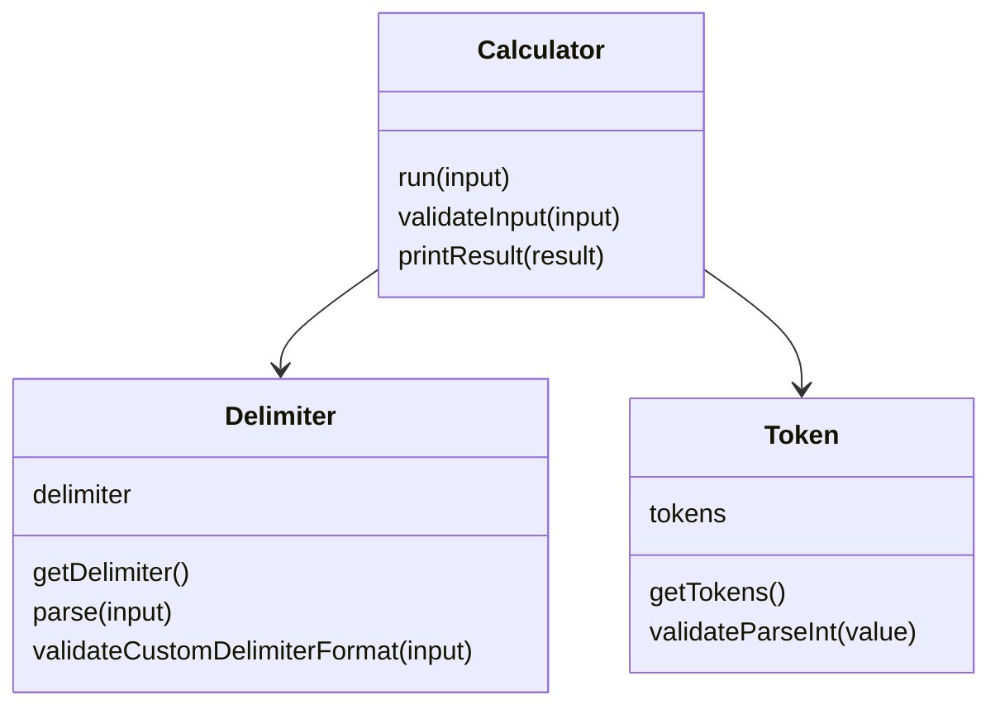

# java-calculator-precourse

## 요구사항 분석 (Requirement)

### 기능 요구사항
입력한 문자열에서 숫자를 추출하여 더하는 계산기
- 기본 구분자 : 쉼표(,) 또는 콜론(:)
  - "" => 0
  - "1,2" => 3
  - "1,2,3" => 6
  - "1,2:3" => 6
- 커스텀 구분자 : 문자열 앞 부분의 "//"와 "\n" 사이에 위치
  - ex) //;\n1;2;3" => 커스텀 구분자: 세미콜론(;), 결과 값은 6

### 예외 처리
잘못된 입력이 들어올 경우 `IllegalArgumentException`을 발생시킨다.

- 숫자로 시작하지 않는 경우
  - ex) "a,1,2"

- 커스텀 구분자 형식이 올바르지 않은 경우
  - ex) "//;\1;2"

- 음수가 포함된 경우
  - ex) "1,-2,3"

- int 범위를 초과하는 경우

## 입출력 요구 사항
### 입력 
구분자와 양수로 구성된 문자열

### 출력
덧셈 결과
```
결과 : 6
``` 

### 실행 결과 예시
```
덧셈할 문자열을 입력해 주세요.
1,2:3
결과 : 6
```

## 도메인 설계



### 책임
- Calculator : 계산 흐름 제어 
- Delimiter : 구분자 파싱 
- Token : 숫자 토큰 관리

### Calculator
문자열 계산기의 실행 흐름과 입출력을 담당한다.
- 사용자 입력을 받아 계산 수행 
- 입력 문자열의 형식 검증 
- 계산 결과 출력

#### 주요 메서드
- run() : 문자열 계산기 실행 
- validateInput() : 입력 문자열의 형식 검증 
- printResult() : 계산 결과 출력


### Delimiter
문자열에서 사용되는 구분자를 파싱하는 역할을 담당한다.
- 기본 구분자(,, :) 처리 
- 커스텀 구분자(//와 \n 사이) 파싱

#### 주요 메서드
- getDelimiter() : 현재 사용되는 구분자 반환 
- parse() : 커스텀 구분자가 존재할 경우, 구분자 정의를 제외한 문자열 반환 
- validateCustomDelimiterFormat() : 커스텀 구분자 형식이 올바른지 검증

### Token
구분자를 기준으로 분리된 숫자 토큰을 관리한다.
- 구분자를 기준으로 문자열 분리 
- 분리된 문자열을 int로 변환 
- int 범위를 초과하는지 검증

#### 주요 메서드
- getTokens() : 구분자를 기준으로 분리된 숫자 배열 반환 
- validateParseInt() : 문자열이 int 범위 내의 숫자인지 검증

## 테스트

도메인 로직의 안정성을 확보하기 위해 각 클래스에 대한 단위 테스트를 작성하였다.

- [DelimiterTest](https://github.com/zzzyoonnn/java-calculator-7-practice/blob/main/src/test/java/calculator/domain/DelimiterTest.java) : 기본 구분자 및 커스텀 구분자 파싱 검증
- [TokenTest](https://github.com/zzzyoonnn/java-calculator-7-practice/blob/main/src/test/java/calculator/domain/TokenTest.java) : 숫자 파싱 및 음수, 형식 검증
- [CalculatorTest](https://github.com/zzzyoonnn/java-calculator-7-practice/blob/main/src/test/java/calculator/domain/CalculatorTest.java) : 전체 계산 흐름 및 결과 검증

## 패키지 구조
```
// main
└── calculator
    ├── Application.java
    └── domain
        ├── Calculator.java
        ├── Delimiter.java
        └── Token.java

// test
└── calculator
    ├── ApplicationTest.java
    └── domain
        ├── CalculatorTest.java
        ├── DelimiterTest.java
        └── TokenTest.java

```

## 구현 전략
초기 구현 단계에서는 기능 구현에 집중하여 하나의 클래스에서 로직을 작성하였다.  
이후 다음 기준으로 리팩토링을 진행하였다.

- 구분자 처리 로직 → Delimiter
- 숫자 검증 및 파싱 → Token
- 전체 실행 흐름 → Calculator

이를 통해 책임을 분리하고 각 클래스가 하나의 역할을 담당하도록 구조를 개선하였다.


## 프로그램 동작 흐름

1. 사용자 입력을 받는다.
2. 커스텀 구분자가 있는지 확인한다.
3. 구분자를 기준으로 문자열을 분리한다.
4. 숫자를 검증한다.
5. 모든 숫자를 더한다.
6. 결과를 출력한다.